<div align="center">

# TURBO&nbsp;SLOP

### *Machine-made. Human-judged.*

A brief goes in. A designed, written and illustrated page comes out — in about a second,
for a fraction of a cent, with every decision typed, scored and reproducible.

[](#testing)
[](https://nodejs.org)
[-3fb950?style=flat-square)](#why-so-few-dependencies)
[](tsconfig.json)
[](LICENSE)

</div>

---

## Why it exists

Generating a page is slow and expensive. *Deciding* a page is fast and cheap — and almost
nobody separates the two.

TurboSlop does. **[Jev](https://typesafe.ai)** (TypeSafe's "System One" decision model) chooses
the design from a curated catalog and returns **calibrated probabilities** instead of prose.
A language model writes the copy. A hosted image model illustrates it. Code composes the
result and owns every fact.

The model never writes markup, never picks a colour that doesn't exist, and never invents a
number about your business. Its freedom is bounded to *pick a card from the deck* — which is
exactly why the output is always renderable, always on-brand, and always typed.

> Six candidate directions for one brief cost **$0.0017 and 11.6 s — two model calls**, because
> previewing does not pay a writer call per direction. Finalizing one adds a single writer call.
> A fully-designed, written and illustrated page costs about **$0.001** and finishes in
> roughly the time it takes to read this paragraph.

---

## Screenshots

### The control surface

Everything in one place: the catalog the machine may speak, the CSS the engine emits, the
artwork it generated, and every design you've ever made — with model calls, decide / inventory /
render / asset timings and the diversity report shown separately for every run.

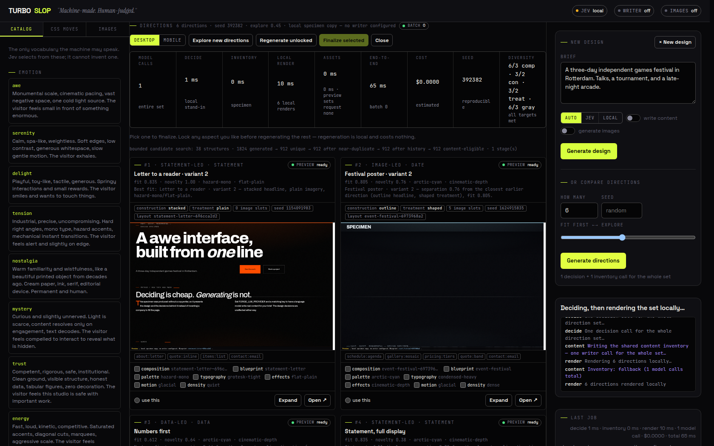

### Compare directions before committing to one

One brief, one decision call, one shared content inventory — then **six directions rendered
locally in milliseconds**, each with its own preview at desktop and mobile width, its block
sequence, its fit and novelty. Lock the aspects you like, regenerate the rest for free, then
finalize the one you keep. That is where the structural variety lives: not in re-running the same
brief and hoping.

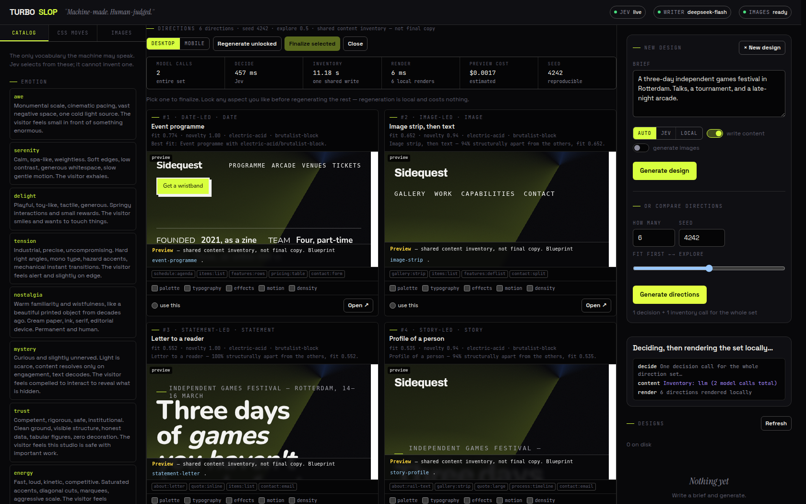

Each card renders in a **real simulated viewport** — 1440×900 desktop, 390×844 mobile — scaled
to fit the card, so resizing a card never changes the design you are judging. Expand any
direction for a first-screen or full-page comparison at the same fixed viewport:

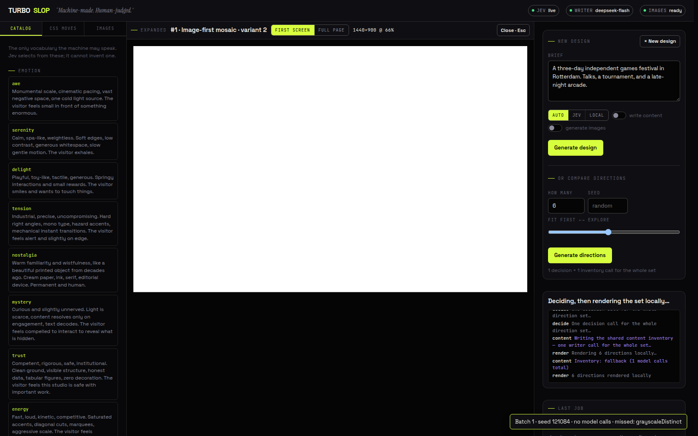

Locks are bound to an explicit value and the card it came from — regenerate and the whole set
re-resolves under those constraints, while the previous batch stays browsable:

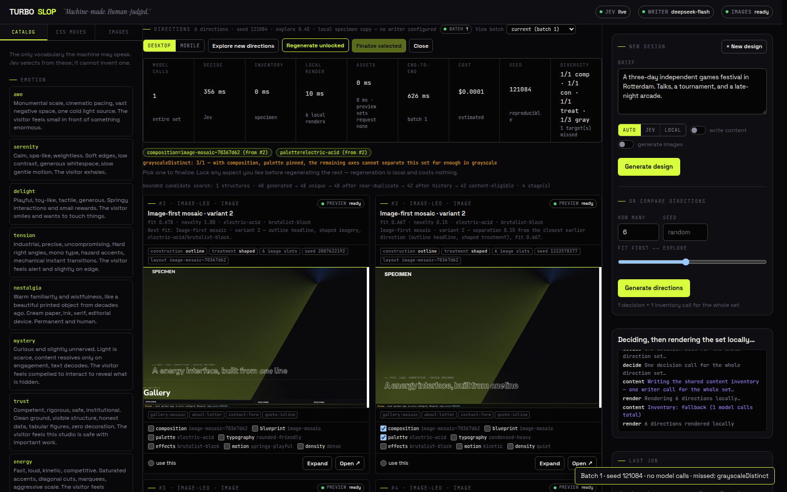

Real photographs import straight into the direction's own slots, with alt text, credit and
licence carried through finalization and export:

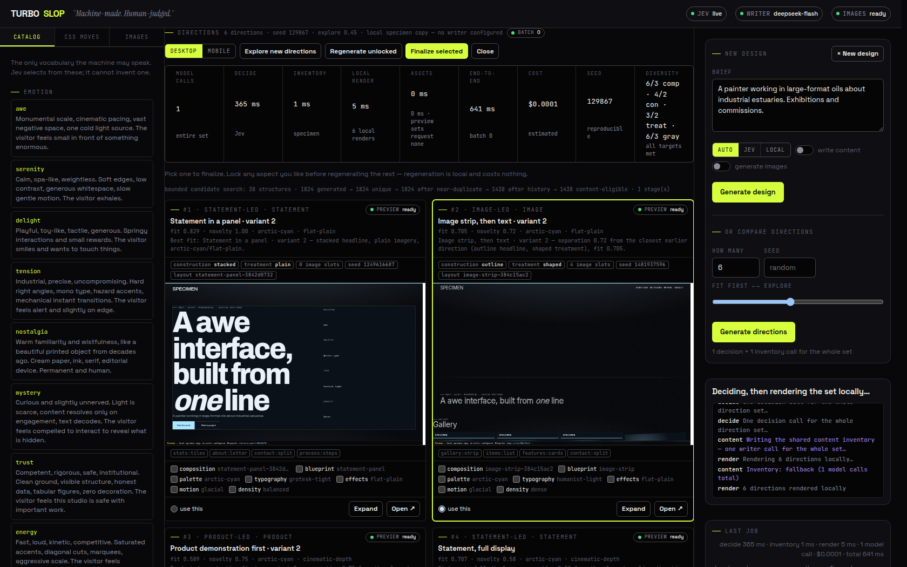

A single direction from that set, at poster scale, in a bundled OFL face with no remote font
request:

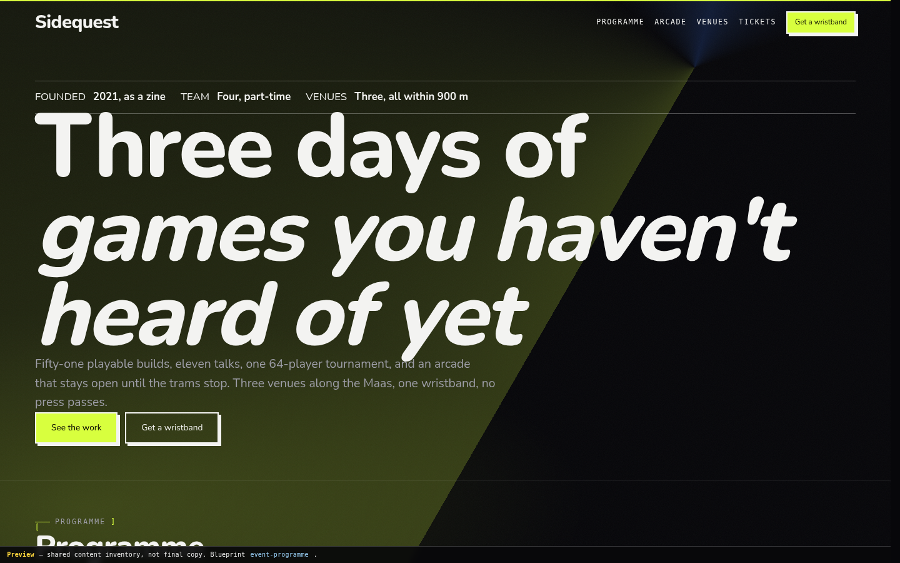

### Iterating on a finished design

Pick any previous design and describe what to change. Revision is a SCOPED edit of the resolved
spec you chose: a copy-only request never touches layout, styling, seed or assets; a visual
request touches only the axes it names; and it never re-runs the decision. The original is
never mutated — you get a new revision with visible lineage.

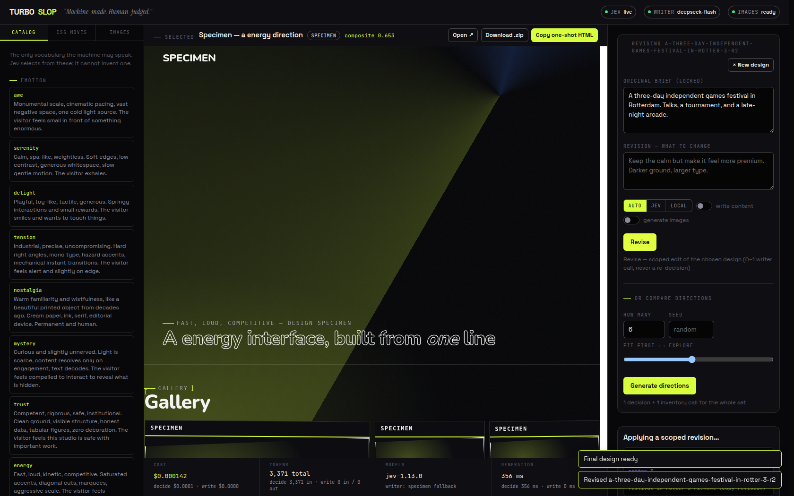

### The CSS it knows

Not a list of features it might use — the ones it **actually emits**, and what each replaces.

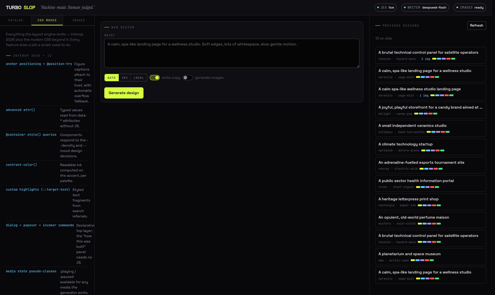

### Generated artwork

Every image with the exact prompt, seed, steps and guidance that produced it.

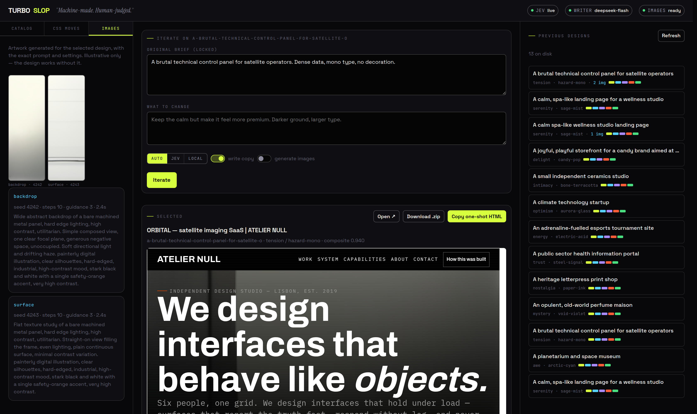

### A generated page

Output of the pipeline above, at `256×256` artwork and all.

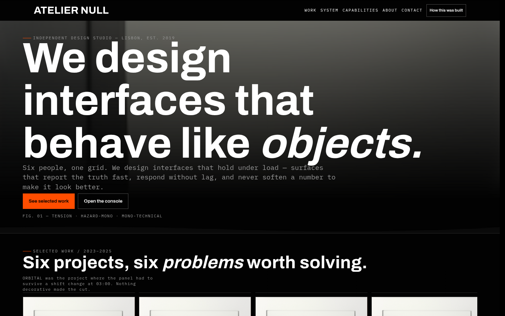
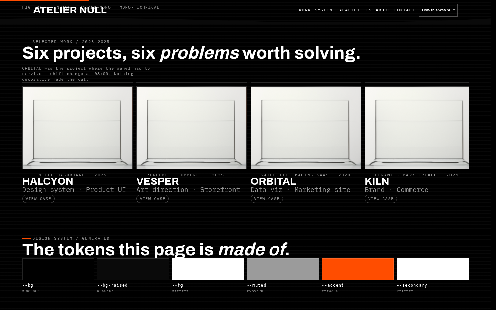

---

## How it works

```
        brief
          │
          ▼
   ┌─────────────┐   one batched call, ~360ms
   │    JEV      │   returns choices + calibrated confidence
   │   decides   │   cannot return a value outside the catalog
   └──────┬──────┘
          ▼
   ┌─────────────┐   ~310ms
   │    LLM      │   writes the prose in the register Jev chose
   │   writes    │   fixed facts are prompt-enforced, not invented
   └──────┬──────┘
          ▼
   ┌─────────────┐   optional, 1.2–12.7s per image
   │   IMAGES    │   illustrative only; the page works without them
   └──────┬──────┘
          ▼
   ┌─────────────┐
   │    CODE     │   composite scoring · confidence gates · typed spec
   │  composes   │   → self-contained HTML
   └─────────────┘
```

| Stage | Model | Job | Cannot |
|---|---|---|---|
| **Decide** | Jev | pick + rank from the catalog, with confidence | write a sentence |
| **Write** | any OpenAI-compatible LLM | prose in the chosen register | change a fact or a colour |
| **Illustrate** | Supra2 | 256×256 artwork | affect layout or copy |
| **Compose** | code | weights, thresholds, tokens, markup | hallucinate |

**Every stage is optional.** No Jev key → a deterministic local decider. No LLM → canonical
copy. No image service → CSS gradient fallbacks. The page always ships. Image generation is
opt-in (the switch in the surface / `images.enabled` in the API) **and it constrains the layout
search**: with images on, a page that cannot hold one is never chosen, so the setting cannot be
silently dropped. A fresh single-design generate also skips the kind of opening the project just
used, so two similar briefs do not come back as the same page.

See [`ARCHITECTURE.md`](ARCHITECTURE.md) for how the layers fit together,
[`docs/JEV-RESEARCH.md`](docs/JEV-RESEARCH.md) for the decision-model research,
[`docs/MODERN-CSS.md`](docs/MODERN-CSS.md) for the CSS feature set,
[`docs/LAYOUT-DIVERSITY.md`](docs/LAYOUT-DIVERSITY.md) for how page structure is chosen —
including the measured baseline this work started from and the limitations that remain — and
[`docs/IMPLEMENTATION-REPORT.md`](docs/IMPLEMENTATION-REPORT.md) for this pass's measurements,
commands and requirement-to-evidence mapping, and
[`docs/DYNAMIC-DESIGN-PLAN.md`](docs/DYNAMIC-DESIGN-PLAN.md) for the measured plan to make
designs procedurally generated rather than catalog-picked, and
[`docs/ASSET-SOURCES.md`](docs/ASSET-SOURCES.md) for the asset/licence register — where the
fonts, icons, patterns and CSS techniques come from and which are safe to vendor.

---

## Quickstart

```bash
git clone <your-fork> turboslop
cd turboslop
npm install

# 1. optional: live Jev decisions
export TYPESAFE_API_KEY=...        # https://typesafe.ai

# 2. optional: a copywriter (any OpenAI-compatible endpoint)
export FORGE_LLM_PROVIDER=deepseek
export DEEPSEEK_API_KEY=...

# 3. optional: image generation
export FORGE_IMAGE_BASE_URL=https://your-host:4363

npm run serve          # http://127.0.0.1:4400
```

Then open **http://127.0.0.1:4400**, write a brief, and hit *Generate design*.

### Command line

```bash
npm run decide -- --brief "A calm, spa-like landing page for a wellness studio"
npm run decide -- --brief "..." --images --image-count 3 --image-preset preview
npm run decide -- --briefs briefs.example.json --out out
npm run decide -- --brief "..." --decider local --no-copy     # fully offline
```

| Flag | |
|---|---|
| `--brief` / `--briefs` | one brief, or a JSON batch |
| `--decider auto\|live\|local` | `auto` uses Jev when a key is present |
| `--no-copy` | skip the LLM, keep canonical copy |
| `--images` `--image-count` `--image-preset` `--image-steps` `--image-guidance` `--image-seed` | image generation |

### Image presets

| Preset | Steps / guidance | Measured |
|---|---|---|
| `turbo` | 4 / 2 | ~1.2 s |
| `preview` | 10 / 3 | ~3.4 s |
| `balanced` | 20 / 3 | ~6.0 s |
| `reference` | 50 / 3 | ~12.7 s |
| `fast` | 20 / **1** | ~4.3 s |

Workflow defaults, **not** quality claims. Guidance `1` skips the unconditional prediction so
it is genuinely cheaper; guidance `2`, `3` and `5` all cost the same as each other.

---

## Exporting

Every design exports three ways:

| | |
|---|---|
| **ZIP** | `index.html` + `index.selfcontained.html` + `design.spec.json` + `assets/` + a `README.md` documenting the brief, every decision with its confidence, and every image prompt |
| **One-shot HTML** | a single self-contained file with all artwork inlined as data URIs — copy it into an email, a gist, a CMS field, anywhere |
| **Spec JSON** | the full decision record, including every probability, for audit or replay |

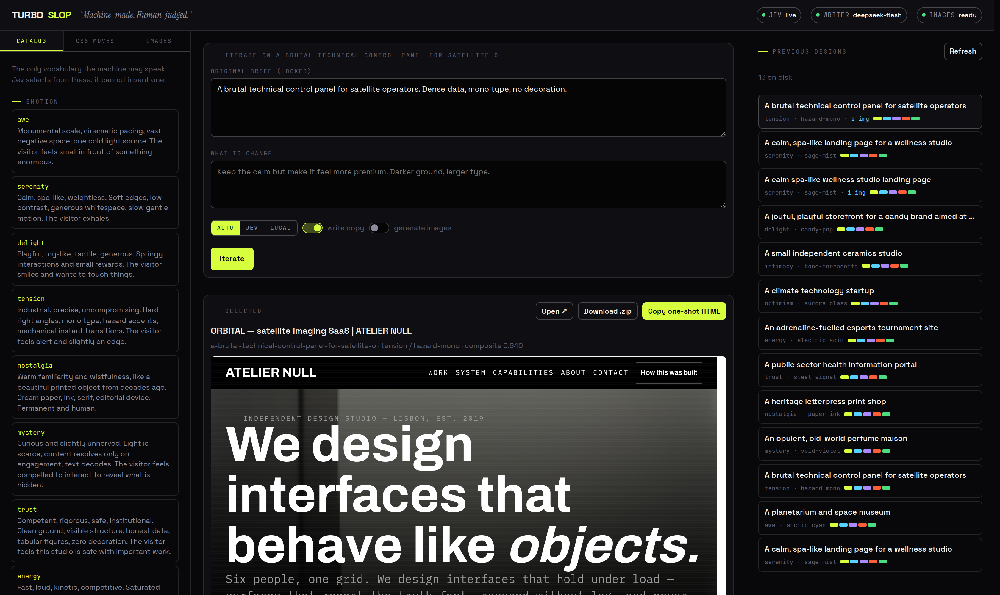

From the surface: **Download .zip** or **Copy one-shot HTML**.
From the CLI: everything is already in `out/`.

---

## Deployment

The control surface is a single Node process. Generated designs are static files, so you can
deploy either the *tool* or just its *output*.

> ### One thing to know first
> Image generation talks to **any reachable HTTP endpoint** — that is the only requirement.
> There is no default host and no assumption about your network: a service on `localhost`, on
> your LAN, behind a VPN, behind Tailscale, or behind a reverse proxy all work identically.
> Decisions, copy and rendering need only outbound HTTPS.
> If the endpoint is unreachable, TurboSlop ships the page without artwork and says so.
> See [Image generation](#image-generation) below.

### 1. Local

```bash
npm install && npm run serve
```

### 2. Static output (the simplest deploy)

Generated pages are self-contained. Publish `out/` to any static host:

```bash
npm run decide -- --brief "..." --images --out dist
npx serve dist                      # or: netlify deploy --dir dist, vercel deploy dist,
                                    #     aws s3 sync dist s3://bucket --delete
```

This is the right choice when you only need the *results* — no server, no keys, no runtime.

### 3. Docker

```bash
docker build -t turboslop .
docker run -d --name turboslop -p 4400:4400 \
  -v turboslop-out:/data/out \
  -e TYPESAFE_API_KEY=... \
  -e DEEPSEEK_API_KEY=... \
  -e FORGE_LLM_PROVIDER=deepseek \
  turboslop
```

The image runs unprivileged, keeps `out/` on a volume so designs survive redeploys, and has a
`HEALTHCHECK` against `/api/state`. If your image service is tailnet-only, add
`--cap-add=NET_ADMIN` and mount a Tailscale sidecar (below).

### 4. VPS with systemd + nginx

```bash
sudo useradd -r -s /usr/sbin/nologin turboslop
sudo mkdir -p /opt/turboslop /var/lib/turboslop /etc/turboslop
sudo rsync -a --exclude node_modules --exclude out ./ /opt/turboslop/
cd /opt/turboslop && sudo npm install --no-audit
sudo chown -R turboslop:turboslop /opt/turboslop /var/lib/turboslop

# secrets, root-owned and unreadable to others
sudo install -m 600 -o root -g root /dev/null /etc/turboslop/env
sudo tee /etc/turboslop/env >/dev/null <<'EOF'
TYPESAFE_API_KEY=...
DEEPSEEK_API_KEY=...
FORGE_LLM_PROVIDER=deepseek
EOF

sudo cp deploy/turboslop.service /etc/systemd/system/
sudo systemctl daemon-reload && sudo systemctl enable --now turboslop
sudo cp deploy/nginx.conf /etc/nginx/sites-available/turboslop
sudo ln -s /etc/nginx/sites-available/turboslop /etc/nginx/sites-enabled/
sudo nginx -t && sudo systemctl reload nginx
sudo certbot --nginx -d turboslop.example.com
```

The unit is hardened (`ProtectSystem=strict`, `ProtectHome`, `NoNewPrivileges`, a single
writable path). The nginx config **disables proxy buffering on `/`** — without that, Server-Sent
Events progress stalls until the run finishes and the surface looks frozen.

### 5. Fly.io / Railway / Render

Any of them will run the `Dockerfile` as-is. Set the same environment variables, mount a
volume at `/data/out`, and expose port `4400`.

```toml
# fly.toml
app = "turboslop"
[build] dockerfile = "Dockerfile"
[env] FORGE_PORT = "4400" FORGE_OUT_DIR = "/data/out"
[mounts] source = "turboslop_out" destination = "/data/out"
[http_service] internal_port = 4400 force_https = true
```

<a id="image-generation"></a>
### 6. Image generation — pick whichever topology fits

Artwork comes from any HTTP endpoint that speaks this API. **There is no default host**:
`FORGE_IMAGE_BASE_URL` is the only thing that turns it on. Four common setups, all equally
supported:

#### a. Local service — no network at all

```bash
FORGE_IMAGE_BASE_URL=http://127.0.0.1:8000
```

`localhost`, `127.0.0.1` and `::1` are always permitted, so this needs no allowlist entry.
Best for a single machine, air-gapped work, or a GPU box you SSH into.

#### b. LAN / private network

```bash
FORGE_IMAGE_BASE_URL=http://192.168.1.50:8000
FORGE_IMAGE_ALLOW_HOSTS=192.168.1.50
```

Any hostname that is not localhost must be named in `FORGE_IMAGE_ALLOW_HOSTS` (comma-separated,
hostnames only — ports are not part of the match). This is what stops the app being turned into
an arbitrary fetch proxy by a crafted request.

#### c. Over a tunnel — VPN, WireGuard, SSH, Tailscale, ZeroTier

```bash
FORGE_IMAGE_BASE_URL=https://your-host.your-tailnet.ts.net:4363
FORGE_IMAGE_ALLOW_HOSTS=your-host.your-tailnet.ts.net
```

TurboSlop does not care *how* the route exists — only that the endpoint is reachable from the
process making the request. An SSH tunnel is often the simplest:

```bash
ssh -N -L 8000:127.0.0.1:8000 user@gpu-box &
FORGE_IMAGE_BASE_URL=http://127.0.0.1:8000
```

If you do use Tailscale in a container, a sidecar works:

```yaml
# docker-compose.yml
services:
  tailscale:
    image: tailscale/tailscale:latest
    environment:
      - TS_AUTHKEY=${TS_AUTHKEY}
      - TS_STATE_DIR=/var/lib/tailscale
      - TS_USERSPACE=false
    volumes: [ts-state:/var/lib/tailscale]
    cap_add: [NET_ADMIN, SYS_MODULE]
    restart: unless-stopped
  turboslop:
    build: .
    network_mode: "service:tailscale"     # shares the tailnet interface
    environment:
      - FORGE_IMAGE_BASE_URL=https://your-host.your-tailnet.ts.net:4363
      - FORGE_IMAGE_ALLOW_HOSTS=your-host.your-tailnet.ts.net
    volumes: [slop-out:/data/out]
    depends_on: [tailscale]
volumes: { ts-state: {}, slop-out: {} }
```

If the service authenticates by network identity, **do not forge identity headers** and do not
expose it publicly. If the deployment identity is not authorised, leave images off — the rest
of the pipeline is unaffected.

#### d. Behind a reverse proxy, with a token

```bash
FORGE_IMAGE_BASE_URL=https://images.internal.example.com
FORGE_IMAGE_ALLOW_HOSTS=images.internal.example.com
FORGE_IMAGE_TOKEN=...                     # sent as `Authorization: Bearer ...`
# FORGE_IMAGE_TOKEN_HEADER=X-Api-Key      # for a non-bearer scheme
# FORGE_IMAGE_ORIGIN=https://images.internal.example.com   # only if it checks Origin
```

#### Trusted-network shortcut

If the endpoint is only ever reachable from a network you control, you can skip the allowlist:

```bash
FORGE_IMAGE_ALLOW_ANY_HOST=1
```

Only do this where an SSRF would not matter. The allowlist exists because the spec that drives
a request is machine-generated.

Everything above is documented inline in [`.env.example`](.env.example).

---

## Configuration

| Variable | Default | Purpose |
|---|---|---|
| `TYPESAFE_API_KEY` | — | enables live Jev decisions |
| `FORGE_DECIDER` | `auto` | `auto` \| `live` \| `local` |
| `FORGE_LLM_PROVIDER` | `deepseek` | `deepseek` \| `openai` \| `openrouter` \| `groq` \| `together` \| `ollama` |
| `FORGE_LLM_BASE_URL` / `FORGE_LLM_MODEL` / `FORGE_LLM_API_KEY` | — | point at **any** OpenAI-compatible endpoint |
| `FORGE_LLM_EFFORT` | `low` | effort when thinking is **on**; see [Saving time and money](#saving-time-and-money) |
| `FORGE_LLM_THINKING` | `disabled` | thinking mode toggle — **3× faster and 2.7× cheaper when off**, with no loss of output validity |
| `FORGE_IMAGE_BASE_URL` | *unset* | **any** reachable HTTP service; unset = images off |
| `FORGE_IMAGE_ALLOW_HOSTS` | — | extra hostnames beyond localhost (comma-separated) |
| `FORGE_IMAGE_ALLOW_ANY_HOST` | — | `1` disables the allowlist (trusted networks only) |
| `FORGE_IMAGE_TOKEN` / `FORGE_IMAGE_TOKEN_HEADER` | — | auth, if the service needs it |
| `FORGE_IMAGE_ORIGIN` | base URL | only if the service checks `Origin` |
| `FORGE_USER_IMAGE_DIR` | `cwd` | where supplied brand images are read from (never the repo) |
| `FORGE_IMAGE_TIMEOUT_MS` / `FORGE_IMAGE_POLL_TIMEOUT_MS` | `20000` / `180000` | request and job timeouts |
| `FORGE_HOST` / `FORGE_PORT` / `FORGE_OUT_DIR` | `0.0.0.0` / `4400` / `./out` | server bind and storage |

See [`.env.example`](.env.example) for a fully commented template.

> **⚠️ The control surface has no authentication.** It is a local studio tool, not a
> multi-tenant service. Anyone who can reach the port can spend your API credits and generate
> images. Keep `FORGE_HOST=0.0.0.0` on a private network (tailnet, VPN, LAN) or behind an
> authenticating proxy, and prefer `FORGE_HOST=127.0.0.1` when in doubt. The reverse-proxy
> config in [`deploy/nginx.conf`](deploy/nginx.conf) is a good place to add auth.

**Swapping the writer is configuration, not code.** Every provider above speaks the same
`/chat/completions` shape; set three variables and restart.

### Secrets

Nothing here is ever read from the repository. Locally they live in
`~/.config/turboslop/*.env` (mode `600`); in production, in `/etc/turboslop/env` or your
platform's secret store. `.gitignore` covers `.env*`, `*.key`, `*.pem`.

---

## Testing

```bash
npm test         # 13 suites — offline by design; with credentials the live halves run too
npm run typecheck
```

Every suite is offline by construction except the ones that say otherwise: with `TYPESAFE_API_KEY`
and an LLM key present, the live Jev/writer checks and the live-decided diversity set run against
the real services; without them they skip **with the reason in the test name**. Nothing is folded
together — passed, failed and skipped are reported separately.

The authoritative counts (**passed / failed / skipped**, per suite and total) are *generated*
from the captured run rather than hand-maintained: see
[`evidence/tables.md`](evidence/tables.md) §8, produced by `scripts/report.ts` from
`evidence/tests.txt`. The suites:

| Suite | Covers |
|---|---|
| `test/forge.test.ts` | decision composition, composite scoring, confidence gates, catalog drift, blueprint + visual-blueprint validation, fingerprint uniqueness, anchors, hero recipes, typographic recipes, treatments, icons, renderer, modern-CSS emission, **plus the live writer, live Jev decision and their composition** (auto-skip with a reason when unconfigured) |
| `test/images.test.ts` | payload validation, path-traversal refusal, URL allowlist, PNG magic bytes, **foreign-job filtering**, busy/429 backoff, ambiguous submissions, **flat/black frames discarded instead of rendered** |
| `test/zip.test.ts` | CRC-32 vectors, real `unzip` round-trips (incl. Unicode names), DEFLATE vs STORE, traversal rejection, header-safe download filenames |
| `test/motifs.test.ts` | deterministic seeded motifs, element budgets, density, data-URI encoding |
| `test/assets.test.ts` | frame composition, icon consistency and the two vendored icon families (original + Lucide ISC), escaping |
| `test/fonts.test.ts` | every bundled file exists and is a real woff2, licences present, only used faces emitted |
| `test/session.test.ts` | selection makes no model call, previews are labelled, ids unique, anchors resolve, finalize writes a real design |
| `test/slots.test.ts` | slot derivation, texture-vs-native rule, prompt budgets, slot-scoped resolution, supplied-beats-generated |
| `test/diversity.test.ts` | the explore targets on all seven baseline briefs across seeds, near-duplicate rejection, bounded search, project-scoped history, **image-on selection kept to layouts that can hold an image**, **fresh-lead avoidance for repeated standalone runs**, reproducibility, **and the same targets under a live Jev decision** (skips with the reason when no key) |
| `test/locks.test.ts` | locks bound to explicit values and source cards, blueprint/composition locks applied, invalid/incompatible locks explained, immutable previous batches |
| `test/revision.test.ts` | copy-only revision preserves the resolved visual spec; visual edits touch only named axes; no re-decision |
| `test/assetplan.test.ts` | zero slots ⇒ zero asset-service requests (controlled fixture), an image-enabled pipeline resolves to a layout that can hold one and makes real requests, supplied images suppress generation, placement verification, ZIP carries assets + fonts + licences |

Verification evidence (measured pages, screenshots, calibration, generated tables) lives in
[`evidence/`](evidence/); the ZIP writer is additionally verified with Python's `zipfile` — an
independent implementation — and with busybox, see `evidence/zip-unicode.txt`. When the
services are configured, the evidence run also records a **live pass** — real Jev decisions,
a real writer call and a real image batch — in [`evidence/tables.md`](evidence/tables.md) §10;
when they are not, that section says so with the reason instead of vanishing.

---

## Project structure

```
src/
  types.ts        zod schemas + inferred types — the contract
  catalog.ts      every value the machine may emit (the "deck")
  blueprint.ts    the layout grammar: leads, variants, image slots, bounded variation, validation
  fingerprint.ts  resolved-design fingerprints, distances, diversity targets + reports
  history.ts      project-scoped recent-design history (a selection input)
  visual.ts       the visual blueprint: hero + typographic + section recipes, art direction
  blocks.ts       one renderer per module, per variant (data-slot markers, honest empty states)
  directions.ts   bounded candidate search -> enforced-diverse direction sets
  sessions.ts     direction sessions: contact sheet, locks, immutable batches, finalize, revise
  revise.ts       scope classification + catalog-only visual edits for revision
  assetplan.ts    THE asset path: slot ownership, supplied-first, zero-slot rule, placement
  export.ts       ZIP / self-contained / README export builders (shared with tests)
  motifs.ts       deterministic seeded SVG motifs, twelve families
  frames.ts       presentation frames rendered in code (browser, device, ticket, cover…)
  icons.ts        two icon families: the original set + vendored Lucide (ISC), one per page
  iconpacks.ts    vendored Lucide glyph geometry (generated by scripts/fetch-icons.ts)
  fonts.ts        the bundled OFL variable-font pack
  userassets.ts   supplied brand images: copy, credit, licence, real pixel size
  questions.ts    ALL Jev questions, criteria, thresholds, weights  ← review this
  jev.ts          typed transport for POST /v1/systemone
  decider.ts      live (Jev) + deterministic local decider, one interface
  compose.ts      composite scoring + confidence gates → DesignSpec
  writer.ts       the writer: prompt, schema, fixed-fact enforcement
  llm.ts          provider-agnostic chat-completions transport
  images.ts       Supra2 client: allowlist, PNG validation, own-jobs-only filtering
  layout.ts       the layout engine → stylesheet
  render.ts       DesignSpec → self-contained HTML
  pipeline.ts     the one definition of "generate a design"
  registry.ts     design history and lineage
  zip.ts          dependency-free ZIP writer
  server.ts       control surface API + SSE, uploads, scoped revision
public/
  index.html      the control surface (no build step)
deploy/           systemd unit, nginx config
docs/             research, CSS reference, layout-diversity findings, implementation report, screenshots
scripts/          measurement, evidence generation, calibration, report tables, ZIP check, font fetch
baseline/         the measured BEFORE-state: 33 screenshots, specs, structure, timings
after/            the measured AFTER-state, plus the matched comparison in FINDINGS.md
evidence/         the CURRENT corpus: raw.json (fixture + live-service block), measure.json, calibration, tests, tables
ARCHITECTURE.md   how the layers fit together — start here
```

### Why so few dependencies?

One runtime dependency (`zod`). The decision transport, the LLM client, the image client, the
layout engine, the ZIP writer and the HTTP server are all hand-written. For a tool whose whole
claim is *deliberate, inspectable decisions*, a readable dependency tree is part of the
argument.

---

### Saving time and money

The writer dominates both. Measured end-to-end through the real pipeline:

| | Decide (Jev) | Write — thinking **off** | Write — thinking **on** |
|---|---|---|---|
| time | ~0.4 s | **~8.5 s** | ~20.4 s |
| cost | $0.0001 | **~$0.0011** | ~$0.0026 |

**Thinking mode is the lever, and it is off by default.** DeepSeek exposes it
via `{"thinking": {"type": "enabled"|"disabled"}}`; TurboSlop sends `disabled`.
Measured against the same content-model prompt, 2 samples each:

| setting | time | reasoning tokens | cost | JSON valid |
|---|---|---|---|---|
| default (thinking on, effort `high`) | 18.9 s | 2,455 | $0.00231 | 2/2 |
| **`thinking: disabled`** | **7.4 s** | **0** | **$0.00092** | 2/2 |
| `disabled` + `reasoning_effort: none` | **6.2 s** | 0 | **$0.00085** | 2/2 |
| `reasoning_effort: high` | 20.9 s | 4,404 | $0.00336 | 2/2 |

Roughly **3× faster and 2.7× cheaper**, with structured-output validity
unaffected — the written output was actually slightly *larger* without
reasoning.

```bash
FORGE_LLM_THINKING=enabled   # turn deliberation back on, for speed to spend
FORGE_LLM_EFFORT=high        # effort when thinking is on
```

Two related details worth knowing:

- **The field is `reasoning_effort`, not `effort`.** An earlier version of this
  client sent `effort`, which the API *silently ignores* — so every effort
  setting appeared identical, because they were all running at the default.
- **Thinking mode ignores `temperature`.** The client therefore only sends
  `temperature` when thinking is off, rather than implying control it lacks.

The writer is also provider-agnostic, so a cheaper model is a config change:

```bash
FORGE_LLM_PROVIDER=openai
FORGE_LLM_MODEL=gpt-4o-mini
```

---

## What it deliberately does not do

- **No text in the decision layer.** Jev cannot write; the renderer is mechanical.
- **No invented content.** Colours, fonts and layouts come only from the catalog; business
  facts are prompt-enforced and never generated.
- **No silent guessing.** Any axis below its confidence threshold is flagged for review and
  its ranked alternatives are kept in the spec.
- **No blind retries.** The image service has no idempotency key, so an ambiguous submission is
  reported, never repeated.
- **No service-wide cancellation.** `/api/cancel` is deliberately not implemented — it would
  kill other people's queued work.

---

## License

MIT — see [LICENSE](LICENSE).

<div align="center">
<br>
<sub><i>“Machine-made. Human-judged.”</i></sub>
</div>
